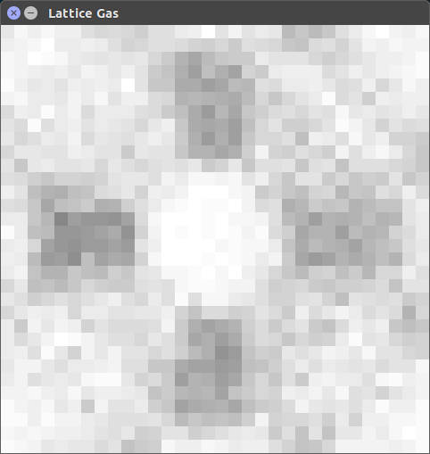
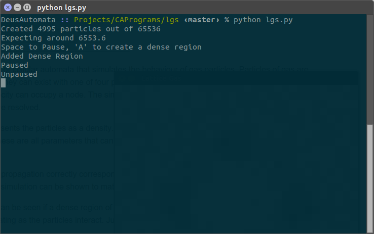

# Lattice Gas Simulation



A lattice gas simulation is a type of cellular automata that simulates the behaviour of gas particles.  Particles of gas are constrained to a regular lattice.  They can exist with one of four possible velocities, corresponding to the four axis' of the grid.  Only one particle of a given velocity can occupy a node.  The simulation updates in two steps, first particles propagate along the lattice, and then collisions are resolved.

The simulation graphically represents the particles as a density.  Each cell painted to the screen actually represents many individual nodes of the lattice (these are all parameters that can be tuned in the lgs_core class).  The darker the cell, the higher the number of particles.

Implementing the collisions and propagation correctly corresponds to the system conserving momentum and mass.  When these principles are upheld, the simulation can be shown to match the same laws governing various fluid phenomna.

For instance, a pressure wave can be seen if a dense region of particles is instantaniously added to the lattice.  An expanding ring of density can be seen radiating as the particles interact.  Just as if the particles were in a balloon that just popped.

# Usage

```
Requires:
python
pygame
numpy

Download, then:
python lgs.py
```


